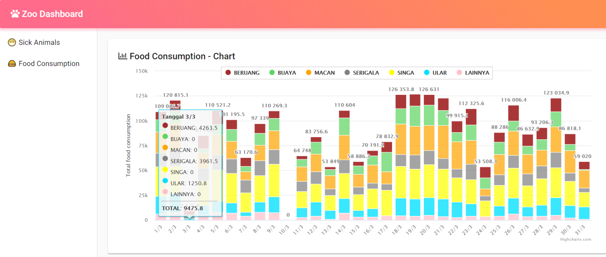

# Zoo Monitoring Dashboard

### 📁 Dependencies

- __React__ _v16.13.1_
- __Materal-UI__ _v4.10.2_
- __Highcharts.js__ _v8.1.2_
- __Highcharts React Official__ _v3.0.0_

### 🔍 Problem Statement

I own a small not-for-profit zoo that is privately managed and supported by society. Currently, I have problem on managing the zoo, as the data is in a mess and all over the place. To resolve the problem as well as provide transparency among the volunteers, I plan to create a simple monitoring dashboard for the zoo. The dashboard includes report for data such as animals’ health, food procurement, food consumption, and ticket selling.

### ⭐ Result

- Screenshot 1 - Sick animal page

    

- Screenshot 2 - Food consumption (stacked column bar) 

    

- Screenshot 3 - Food consumption (table) 

    

#### Lintang Wisesa :love_letter: _lintangwisesa@ymail.com_

[Facebook](https://www.facebook.com/lintangbagus) | 
[Twitter](https://twitter.com/Lintang_Wisesa) |
[LinkedIn](https://www.linkedin.com/in/lintangwisesa/) |
[Youtube](https://www.youtube.com/user/lintangbagus) | 
:octocat: [GitHub](https://github.com/LintangWisesa) |
[Hackster](https://www.hackster.io/lintangwisesa)